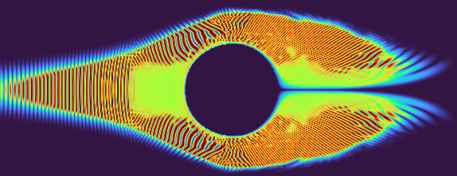

# SimuFlow

SimuFlow is a 2D fluid dynamics simulation written in Python, implementing a simplified incompressible Navier-Stokes solver on a structured grid. It simulates the behavior of a scalar dye field advected and diffused by a velocity field, making it useful for educational purposes and prototyping fluid mechanics concepts.



## Features

- Incompressible Navier-Stokes solver (2D)
- Advection-diffusion of scalar quantities
- Pressure Poisson equation solved using sparse matrix methods
- Obstacle masking to simulate solid objects
- Customizable inflow velocity, viscosity, and grid resolution
- Output of velocity, pressure, vorticity, and scalar concentration
- Modular architecture for solver, mesh, boundary, and visualization

## Technologies

- Python
- NumPy
- SciPy (sparse linear algebra)
- Matplotlib
- tqdm (progress bar)

## Usage

1. Clone the repository:

   ```bash
   git clone https://github.com/obelisk2u/SimuFlow.git
   cd SimuFlow
   ```

2. Modify the configuration in `config.yaml` to set domain size, grid resolution, viscosity, and simulation steps.

3. Run the simulation:

   ```bash
   python main.py
   ```

4. View generated plots of velocity field, pressure distribution, and scalar dye field.

## Directory Structure

- `main.py` — Entry point; sets up configuration and runs the simulation
- `mesh/` — Grid creation
- `physics/` — Initial condition setup
- `solver/` — Navier-Stokes solvers and linear solvers
- `utils/` — Visualization utilities
- `config.yaml` — YAML config file
